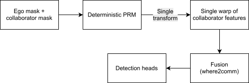
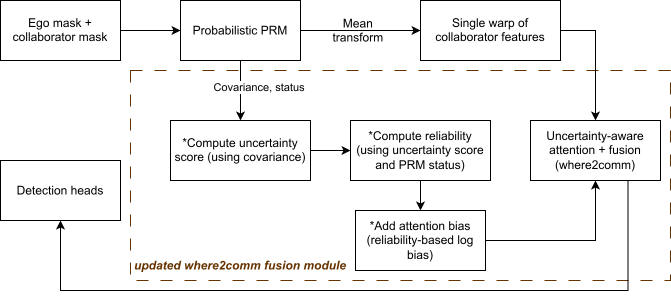

# Overview of changes

Main changes are in the pose rectification and collaborator warping stages.

Original:




Our:



## v1.0. Probabilistic PRM

**Original** PRM output was a single transform. 

**Instead**, we output the following for each ego-collaborator pair:
1. `mu_affine(μ)` : mean 2D affine transform
2. `mu_params = [theta, tx, ty]`
3. `Sigma_params(Σ)`: 3×3 covariance over `[theta, tx, ty]`
4. `status(s)`: PRM status flag

Thus, we added uncertainty estimation to the PRM.

Current covariance is calculated using least squares geometric covariance.

Uncertainty was then passed to the where2comm fusion model. 

## v2.0. Uncertainty-aware fusion

### i. Warping

The feature warping is done with the mean transform for each collaborator pair:

$\tilde{F}_i = \mathrm{Warp}(F_i, \mu_i)$

where,
- $F_i$ : BEV feature map of collaborator
- $\tilde{F}_i$ : aligned BEV feature map of collaborator
- $\mu_i$  : mean transform from PRM module 

### ii. Get uncertainty score from covariance

Take trace of covariance (this will correspond to a measure of uncertainty):

$c_i = \mathrm{tr}(\Sigma_i)$

Clip it (to make reliability stable and prevent affects of very high covariance values): 

$\bar{c}_i = \mathrm{min}(\mathrm{max}(c_i, 0), c_{\mathrm{max}})$

where $c_{max}$ is a preset threshold


PART IN CODE:
Inside ```covariance_to_fusion_reliability(...)```:
```
cov_trace_raw = float(np.trace(Sigma_params))
cov_trace_raw = max(cov_trace_raw, 0.0)
cov_trace_clipped = min(cov_trace_raw, self.uncertainty_conf_trace_clip)
```


### iii. Convert uncertainty to reliability

Step 1:
For a collaborator $i$:

if $s_i \neq ok$:
- $r_i = r_{min}$

if  $s_i = ok$:
- $r_i = \mathrm{clip}\left((1+\bar{c}_i)^{-\alpha}, r_{\mathrm{min}}, r_{\mathrm{max}}\right)$
where
- $r_{min}$ and $r_{max}$ are preset thresholds.
- $\alpha$ is a preset constant which determines how strongly covariance affects reliability


Step 2:
Original Feaco model's where2comm score calculation:

$e_{pq}^{(i,j)} = \frac{Q_{p}^{(i)} \cdot K_p^{(j)}}{\sqrt d}$ 

where
- $p$ is a BEV spatial location
- $i$ is query CAV
- $j$ is key CAV
- $d$ is feature dimension
- $Q$ is query feature vector
- $K$ is key feature vector

PART IN CODE:
Inside the ```forward``` function of ```ScaledDotProductAttention``` class inside where2comm architecture:
```
score = torch.bmm(query, key.transpose(1, 2)) / self.sqrt_dim
```

OUR addition of uncertainty-aware attention bias:

$\tilde{e}_{pq}^{(i,j)} = e_{pq}^{(i,j)} + \beta \mathrm{log}(r_j)$

where
- $\beta$ is the bias strength and it is a preset constant to determine how strongly reliability will affect attention
- $r_j$ is the reliability of the key CAV $j$
Note that $r_j$ will always between 0 and 1. Thus the conditions are:
1. if $r_j = 1$ then $log(r_j) = 0$, so there is no penalty
2. if $r_j < 1$ then $log(r_j) < 0$, so the attention score for that collaborator is reduced (the smaller $r_j$ is the more suppression of the collaborator)

PART IN CODE:
Inside the ```forward``` function of ```ScaledDotProductAttention``` class inside where2comm architecture:
```
if source_confidence is not None:
	conf = source_confidence.to(score.device).float()

bias = bias_strength * torch.log(conf)
score = score + bias.view(1, 1, -1)
```


### iv. Softmax for attention weights and fusion

The general form of the softmax equation (to get the attention weights from the scores) is unchanged. Its original form was:

$a_{ij} = \frac{exp(e_{pq}^{(i,j)})}{\sum_k exp(e_{pq}^{(i,k)})}$

where for each query $i$ , the weights over all key CAVs $j$ add up to 1

Now, substituting values from our updated equation above:

$a_{ij} = \frac{exp(e_{pq}^{(i,j)} + \beta log(r_j))}{\sum_k exp(e_{pq}^{(i,k)} + \beta log(r_k))}$

PART IN CODE:
Inside the ```forward``` function of ```ScaledDotProductAttention``` class inside where2comm architecture:
```
attn = F.softmax(score, -1)
```

## Supporting material

- Github repo: https://github.com/nilushacj/opencood-uncertainty-aware-fusion
	- Main files changed: `point_pillar_where2comm_our.py` and `where2com_multihead_our.py` 
	- PRM function: `get_transform_distribution`
- Sketches (drawio): https://drive.google.com/file/d/1vaxDNvJLUtlgYLgL-tWFppcCqUTuohax/view?usp=sharing

